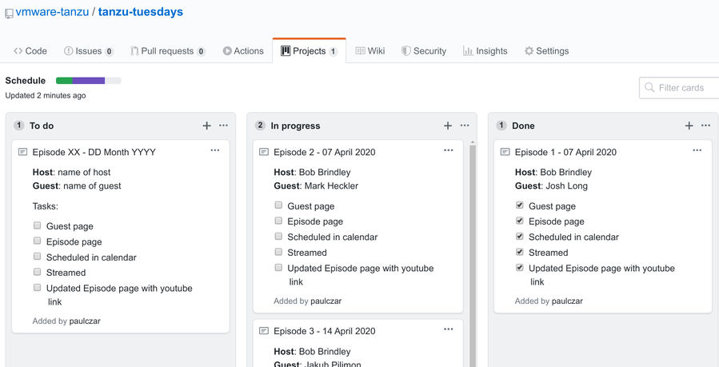

Welcome! If you're here, it means you're a willing participant in this zany thing we call Tanzu Tuesdays. You're probably here to help keep things running smoothly, or perhaps you want to star in your very own episode. Stay tuned and let's talk through scheduling an Episode.

**Note**: This is not set in stone, if you have a better way to do this, we're all ears. Just trying to keep things simple and all in one place.

_We assume you have some familiarity with github, and can perform basic git actions such as `git clone`, `git pull`, `git push`, and create **Pull Requests**. If you do not know how to do these things that's okay, just contact us on slack and we'll help._

## Add a new episode to the schedule

We manage the schedule using a simple Github Projects kanban board [here](https://github.com/vmware-tanzu/tanzu-tuesdays/projects/1).

The first item in the **To do** column is a template, hit the **...** button and select **Edit note** copy the contents and then create a new issue and paste in those contents.

Update the Episode Number and Date as well as the **Host** and **Guest** and save it. Move to the **In Progress** column.



## Request an Avatar and Episode image

We create delightful avatars for each of our guests. You'll need to [request](http://vmwmare.com) **todo add instructions on how** an avatar from the art team, and a corresponding Episode image.

The avatar will be uploaded to [here](https://github.com/vmware-tanzu/tanzu-tuesdays/tree/master/content/img/avatars) and the Episode image will be added to their episode page (described below).


## Create a guest page

From here we need to prepare the guest's page and the episode page. If they're a recurring guest then the guest page should already exist [here](https://github.com/vmware-tanzu/tanzu-tuesdays/tree/master/content/guest). If not then copy the `content/guest/_new.md` to a new file and modify it.

You should have a Bio and a Headshot for the guest, along with some social media handles. The Bio goes into the body of the page, whereas the rest goes into the front-matter (the section between the `+++` lines).

```hugo
+++
Title = "Jakub Pilimon"
Twitter = "@JakubPilimon"
Website = "https://github.com/ddd-by-examples"
Type = "guest"
GitHub = "pillopl"
Thumbnail = "img/guest/jakub.jpg"
+++

[Jakub](https://twitter.com/JakubPilimon) is a Developer Advocate at [VMware](https://vmware.com), blogger, programmer, and trainer. He loves to tackle complex enterprises with Domain-Driven Design, Test-Driven Development and Spring. Architecture is a main area of interest, too. When he doesn't program, he rides motorbikes, skis or practices kitesurfing.

He writes a [DZone MVB awarded blog](https://pillopl.github.io) and his pet projects can be found at [https://github.com/ddd-by-examples](https://github.com/ddd-by-examples).
```

Once the guest page is complete and merged into git you can mark it as complete in the schedule.

## Create an Episode page

You'll also need an episode page. These can be found [here](https://github.com/vmware-tanzu/tanzu-tuesdays/tree/master/content/episode). Each episode has its own directory and you can copy the `content/episode/_new` directory to draft a new episode.

The following is a completed episode page. The author is you, the hosts is a list of people that will be hosting the stream (they must have an entry in [hosts](https://github.com/vmware-tanzu/tanzu-tuesdays/tree/master/content/host)) and the guests is a list of guests (must have an entry in [guests](https://github.com/vmware-tanzu/tanzu-tuesdays/tree/master/content/guest)).

```hugo
+++
Description = "The threads are revolting! viva la reactive revolution!"
aliases = ["/0001"]
author = "paulczar"
hosts = ["bob"]
guests = ["joshlong"]
Date = "2020-04-07"
PublishDate = "2020-04-07"
episode = "0001"
episode_image = "episode/0001/episode.jpg"
#episode_banner = "episode/0001/episode.jpg"
explicit = "no"
images = ["episode/0001/episode.jpg"]
title = "Reactive Revolution with Josh Long"
youtube = ""
truncate = ""
twitch = "makejarnotwar"
+++

Microservices and big-data increasingly confront us with the limitations of traditional input/output.
...
...
 don’t worry! Join me, your guide, Spring developer advocate Josh Long, and we’ll explore the wacky, wonderful world of Reactive Spring together.
```

Once merged into github you can mark the episode page as complete.

## Schedule a Zoom Meeting

**todo** write better instructions

Make sure streaming is enabled see [here](https://tech.paulcz.net/blog/streaming-from-zoom-to-twitch/) for instructions. Ideally you'll use OBS for a higher quality recording, but direct zoom streaming is a viable alternative.

## Schedule a Calendar Invite via Email

**todo** write better instructions

## Make sure OBS is installed and working

**todo** write better instructions

## Host the call

**todo** write better instructions

## Upload the video from Zoom or Twitch to YouTube

**todo** write better instructions

## Update the episode page with the YouTube link

**todo** write better instructions